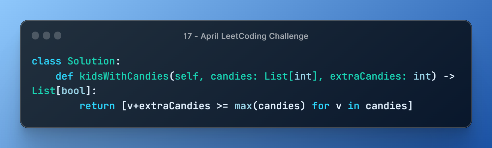
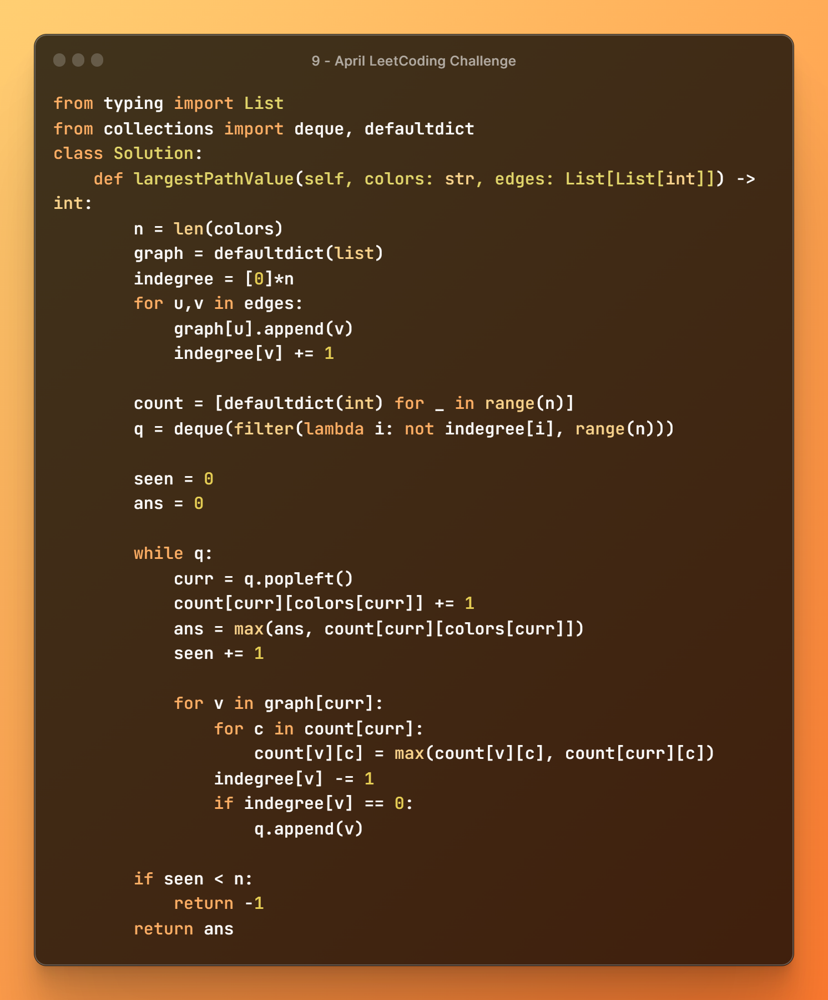

### [Github Repo](https://github.com/vishxm/leetcoding-challenge)

<!--

 -->

### [649. Dota2 Senate](https://leetcode.com/problems/dota2-senate/description/)

### [2215. Find the Difference of Two Arrays](https://leetcode.com/problems/find-the-difference-of-two-arrays/description/)

### [1822. Sign of the Product of an Array](https://leetcode.com/problems/sign-of-the-product-of-an-array/description/)

### [1491. Average Salary Excluding the Minimum and Maximum Salary](https://leetcode.com/problems/average-salary-excluding-the-minimum-and-maximum-salary/description/)

### [1579. Remove Max Number of Edges to Keep Graph Fully Traversable](https://leetcode.com/problems/remove-max-number-of-edges-to-keep-graph-fully-traversable/description/)

### [1697. Checking Existence of Edge Length Limited Paths](https://leetcode.com/problems/checking-existence-of-edge-length-limited-paths/description/)

### [839. Similar String Groups](https://leetcode.com/problems/similar-string-groups/)

### [319. Bulb Switcher](https://leetcode.com/problems/bulb-switcher/description/)

### [258. Add Digits](https://leetcode.com/problems/add-digits/description/)

### [2336. Smallest Number in Infinite Set](https://leetcode.com/problems/smallest-number-in-infinite-set/)

### [1046. Last Stone Weight](https://leetcode.com/problems/last-stone-weight/)

### [1416. Restore The Array](https://leetcode.com/problems/restore-the-array/description/)

### [1312. Minimum Insertion Steps to Make a String Palindrome](https://leetcode.com/problems/minimum-insertion-steps-to-make-a-string-palindrome/)

### [879. Profitable Schemes](https://leetcode.com/problems/profitable-schemes/)

### [662. Maximum Width of Binary Tree](https://leetcode.com/problems/maximum-width-of-binary-tree/)

### [1372. Longest ZigZag Path in a Binary Tree](https://leetcode.com/problems/longest-zigzag-path-in-a-binary-tree/)

### [1768. Merge Strings Alternately](https://leetcode.com/problems/merge-strings-alternately/description/)

### [1431. Kids With the Greatest Number of Candies](https://leetcode.com/problems/kids-with-the-greatest-number-of-candies/description/)

### [1639. Number of Ways to Form a Target String Given a Dictionary](https://leetcode.com/problems/number-of-ways-to-form-a-target-string-given-a-dictionary/description/)

### [2218. Maximum Value of K Coins From Piles](https://leetcode.com/problems/maximum-value-of-k-coins-from-piles/)

### [516. Longest Palindromic Subsequence](https://leetcode.com/problems/longest-palindromic-subsequence/description/)

### [946. Validate Stack Sequences](https://leetcode.com/problems/validate-stack-sequences/description/)

### [71. Simplify Path](https://leetcode.com/problems/simplify-path/description/)

### [2390. Removing Stars From a String](https://leetcode.com/problems/removing-stars-from-a-string/description/)

### [20. Valid Parentheses](https://leetcode.com/problems/valid-parentheses/description/)

### [1857. Largest Color Value in a Directed Graph](https://leetcode.com/problems/largest-color-value-in-a-directed-graph/)

### [133. Clone Graph](https://leetcode.com/problems/clone-graph/)

### [1020. Number of Enclaves](https://leetcode.com/problems/number-of-enclaves/)

### [1254. Number of Closed Islands](https://leetcode.com/problems/number-of-closed-islands/)

### [2439. Minimize Maximum of Array](https://leetcode.com/problems/minimize-maximum-of-array/description/)

### [2405. Optimal Partition of String](https://leetcode.com/problems/optimal-partition-of-string/)

### [881. Boats to Save People](https://leetcode.com/problems/boats-to-save-people/)

### [2300. Successful Pairs of Spells and Potions](https://leetcode.com/problems/successful-pairs-of-spells-and-potions/)

### [704. Binary Search](https://leetcode.com/problems/binary-search/)

